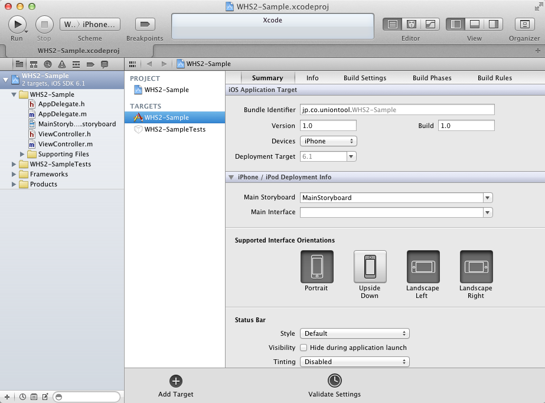
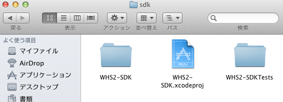
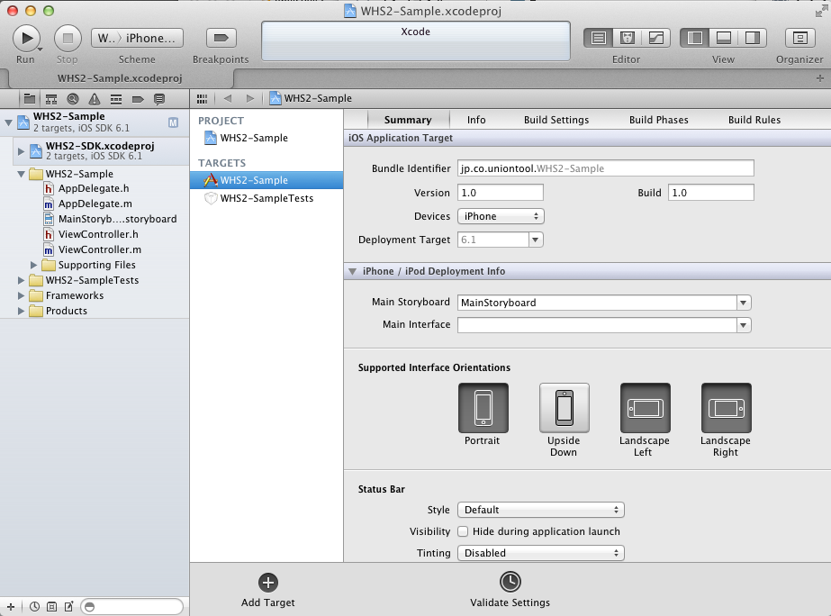
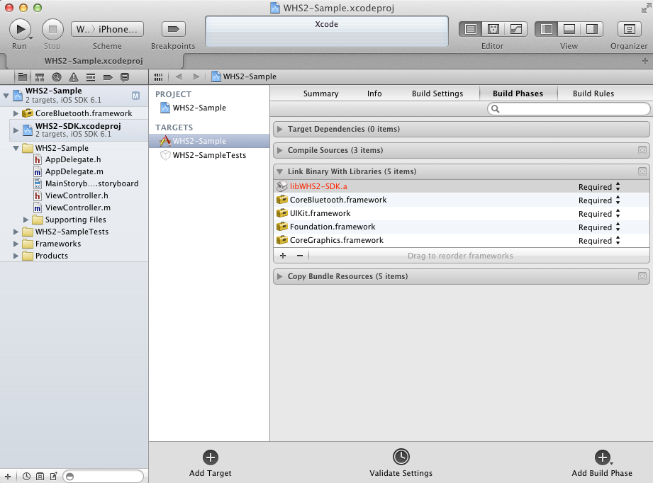
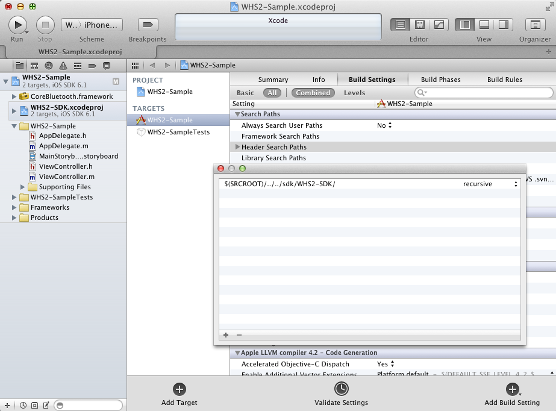

SDK設定手順
-------------------------

(1) XcodeでSDKを利用する新規プロジェクトを開く

(2) GitHubから取得したWHS2-SDK.xcodeprojを、Finderを利用してプロジェクトにドラッグ&ドロップする

GitHubから取得したProject

ドラッグ&ドロップした結果

(3) プロジェクトのBuild PhasesタブのLink Binary With Librariesに、CoreBluetooth.frameworkとlibWHS2-SDK.aを追加する

(4) プロジェクトのBuild SettingsタブのSearch Paths -> Header Serch Pathsにsdk/WHS2-SDK/へのPathを追加する

