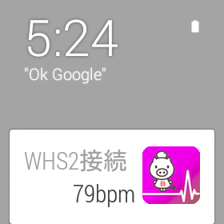
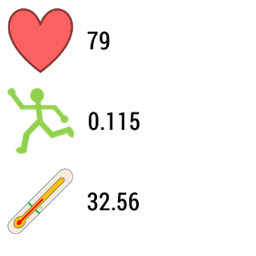
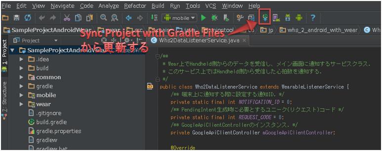

SampleProjectAndroidWear
=============

Android Wear上で心拍数を表示するサンプルプロジェクト

## 概要
このサンプルは、スマートフォンやタブレットがWHS-2から受信した心拍数をAndroid Wear上で表示します。

スマートフォンやタブレットとWHS-2が接続している間は、常に心拍数を表示します!

通知からアプリを開けば、心拍数・体動・体表温を表示する画面が表示されます!

## サンプルプロジェクトの実行手順

### 1.Android Studioからプロジェクトを読み込む
クローンしたサンプルプロジェクトを指定して読み込みます。

### 2.Gradleファイルを更新

### 3.プロジェクトの実行
スマートフォン用は``mobile``、Wear用は``wear``を実行します!