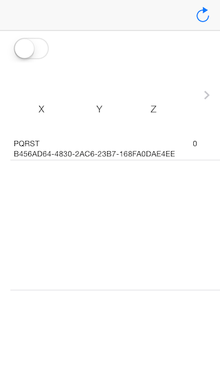
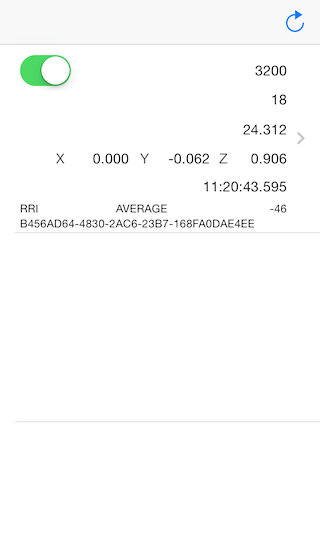
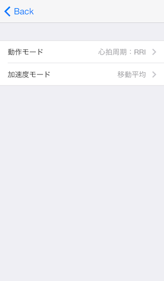
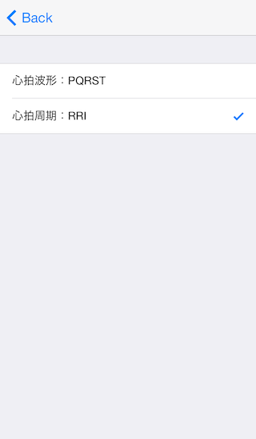
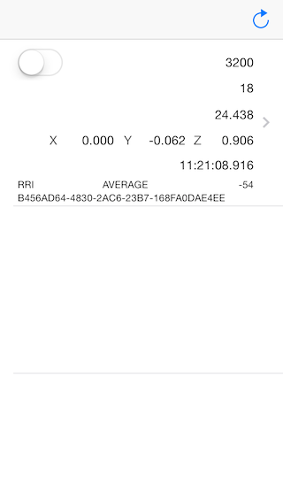

アプリ動作説明
-------------------

###1.アプリの起動###
起動時は何も表示されてません。
周辺のWHS-2を検索する場合、画面右上のリフレッシュボタンで検索が行われます。

###2.WHS-2との接続###
WHS-2が発見された場合、以下の画面のようにデバイスが表示されます。
UISwitchコントロールをONにする事で、WHS-2と接続が開始されます。

###3.計測値の受信###
接続が完了した場合、自動的に受信が始まります。
受信された計測値は下記の画面のように表示されます。

#####表示されている値######

  - RRI
  - 心拍数 (60000/RRI)
  - 体表温
  - 加速度
  - 受信日時
  - 計測モード
  - WHS-2 RSSI
  - WHS-2 UUID

###4.設定画面###
接続中のデバイスの行をタップすると、設定画面に遷移します。

　

###5.WHS-2との切断###
UISwitchコントロールをOFFにする事で、WHS-2と接続が終了します。

